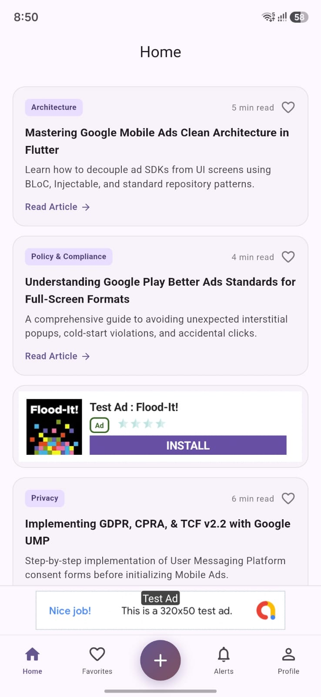
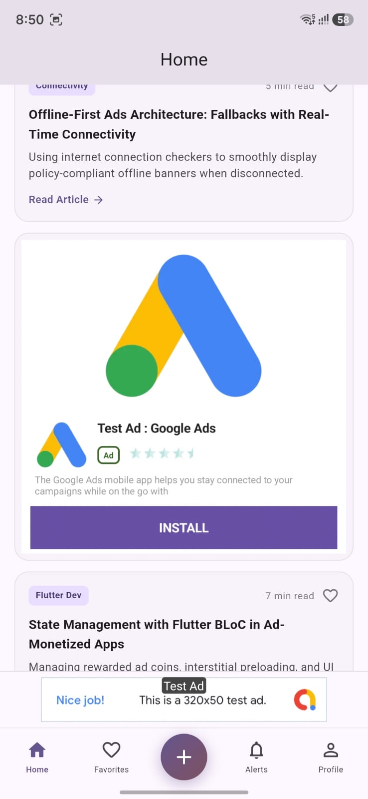
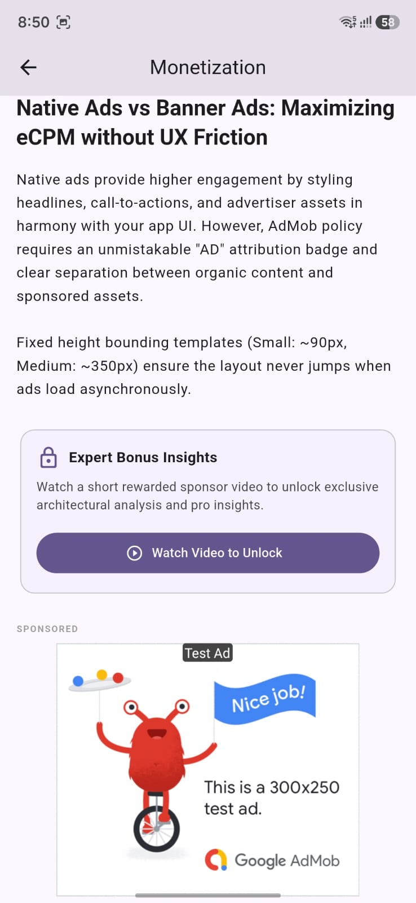

# Flutter Prakash Ads (`flutter_prakash_ads`)

[](https://pub.dev/packages/flutter_prakash_ads)
[](https://flutter.dev)
[](https://admob.google.com)
[](LICENSE)
[](https://pub.dev/packages/flutter_prakash_ads)
[](https://support.google.com/admob)
[](https://prakashbahadurchand.com.np)

An enterprise-grade, policy-compliant, standalone Google Mobile Ads package for Flutter applications. Built with zero dependency-injection lock-in, reactive "Remove Ads" toggles, offline fallback house ads, unified analytics telemetry, and ready-to-use Agent Skills for autonomous AI integration.

---

## 📸 Showcase & Interactive Previews

<div align="center">

| 1. Feed Integration & Banners | 2. Rich Native Ad Templates | 3. Rewarded Content & Medium Ads |
| :---: | :---: | :---: |
|  |  |  |
| *Anchored Adaptive Banner & Small Native Ad* | *Fluid Medium Native Ad Template (350px)* | *Gated Rewarded Video Trigger & Inline 300x250* |

</div>

<br/>

> 🎥 **[Watch Full Video Demonstration (MP4)](assets/videos/screen_recording_1.mp4)**
> 
> *The video walk-through demonstrates:*
> - ⚡ **Instant App Open Ad** cold-start transition without UI freezing.
> - 🔄 **Smooth Adaptive Banner & Native Ad Rendering** inline within scrollable feed lists.
> - 🎁 **Rewarded Video Ad Flow** unlocking gated content with coin/reward callbacks.
> - 🚫 **Instant "Remove Ads" (Ad-Free Mode)** hiding all mounted banners and native ads in real-time.
> - 🌐 **Automatic Offline House Ad Fallback** when connectivity is lost or fill fails.

---

## ✨ Features

- 🛡️ **Zero DI Lock-in**: Fully standalone. Works out of the box with Riverpod, BLoC/Cubit, Provider, GetX, or vanilla Flutter without requiring `injectable` or `get_it`.
- ⚡ **Zero-Latency Conditional Network Architecture**: If custom ads are not configured (`AdsManager.setupCustomAds(...)`), the package **completely skips all network/internet checks** for banner, native, and full-screen ads—eliminating DNS lookups, latency, and socket pings. AdMob ads request immediately.
- ⚙️ **One-Line Production/Test Switching**: Switch seamlessly between official Google test ads and production AdMob units using `AdManager.setRealAds(...)`.
- 💎 **Reactive "Remove Ads" (IAP)**: Instantly hide and dispose all mounted banner and native ads across the widget tree with `AdManager.setAdsEnabled(false)`.
- 🎨 **Custom / House Ads & Offline Fallbacks**: Render promotional or offline ads (`CustomAdModel`) with asset/network images, custom badges, and centralized click routing (`AdManager.onCustomAdClicked`). If custom ads are not configured, widgets cleanly collapse without showing unwanted placeholder ads.
- 📊 **Unified Analytics Telemetry**: Capture all lifecycle events (Loaded, Failed, Showed, Dismissed, Clicked, Impression, Paid / ILRD, Reward Earned) via `AdManager.onAdEvent` or `AdManager.adEventStream` for logging to Firebase Analytics, Adjust, AppsFlyer, etc.
- 🤖 **Agentic Coding Ready (`SKILL.md`)**: Includes official agent skill instructions in `.agents/skills/flutter-prakash-ads/SKILL.md` for AI pair programmers and autonomous coding assistants.
- 📐 **Anchored Adaptive Banners**: Built-in `SmartBannerAdView.getAnchoredAdaptiveAdSize(context)` to maximize fill rates and eCPMs.
- 👶 **COPPA & Google Play Families Policy Ready**: Configure child-directed treatment, age of consent, and content rating tags with `AdManager.updateRequestConfiguration(...)`.
- 🔒 **GDPR / UMP Consent Ready**: Built-in `ConsentManager` for EEA/UK GDPR compliance and privacy options revocation forms with local caching resilience.
- ⏱️ **AdMob & Play Policy Guardrails**:
  - **Anti-Stacking Collision**: Prevents App Open, Interstitial, and Rewarded ads from ever presenting simultaneously.
  - **4-Hour Max-Age Expiration**: Automatically evicts stale cached impressions.
  - **30s Interstitial Throttling**: Prevents rapid ad spam and user fatigue.
  - **App Open Cold-Start & Background Guards**: 4-second timeout deadline and 15-second background threshold.
  - **CLS Prevention**: Fixed dimensional bounding prevents Cumulative Layout Shifts and accidental clicks without distracting spinners.

---

## 🤖 1-Click AI Agent Integration Prompt

Using an AI coding assistant (such as Claude Code, Cursor, Windsurf, Copilot, or Antigravity)? Copy and paste this prompt directly into your AI agent chat:

```markdown
Integrate `flutter_prakash_ads` (version ^0.0.5) into my Flutter application with production-grade clean architecture best practices:
1. Canonical import: Use `import 'package:flutter_prakash_ads/fp_ads.dart';` across all ad code.
2. Architecture & State Management (Recommended):
   - Create `core/ads/my_ads_service.dart` to encapsulate SDK initialization, GDPR/UMP consent evaluation, custom offline fallback ads (`AdsManager.setupCustomAds(...)`), and centralized ILRD telemetry / Firebase analytics event logging (`AdsManager.onAdEvent(...)`).
   - Create `core/ads/cubit/ads_cubit.dart` and `core/ads/cubit/ads_state.dart` (similar to the reference pattern in `example/lib/core/ads/`) to manage ad availability, reward balance/coins, user snackbars, and full-screen ad presentation logic.
3. Android/iOS manifests: Verify `com.google.android.gms.ads.APPLICATION_ID` in `AndroidManifest.xml` and `GADApplicationIdentifier` in `Info.plist`. Include `OPTIMIZE_INITIALIZATION`, `OPTIMIZE_AD_LOADING`, and Android 13+ `AD_ID` permission.
4. SDK Initialization: In `main()`, invoke the consent and initialization workflow. When allowed (`consent.canRequestAds`), initialize `await AdManager.instance.initialize()` and `await AdManager.instance.initializeAppOpenAd()`.
5. Production IDs: Configure real IDs using clean platform separation (`AdManager.setRealAndroidAds(...)` and `AdManager.setRealIosAds(...)`).
   - Parameter order: `banner -> native -> interstitial -> rewardedInterstitial -> rewarded -> appOpen`.
   - Supports up to 3 banner IDs (`banner`, `banner2`, `banner3`) and up to 3 native IDs (`native`, `native2`, `native3`) with automatic cascading fallback (Unit 3 -> Unit 2 -> Unit 1).
6. Widgets:
   - Banner: Use `SmartBannerAdView()` (or `SmartBannerAdView.withAdUnitId2()`, `SmartBannerAdView.withAdUnitId3()`).
   - Native: Use `SmartNativeAdView(templateType: TemplateType.medium)` (or `SmartNativeAdView.withAdUnitId2()`, `SmartNativeAdView.withAdUnitId3()`).
7. Interstitial & Rewarded: Route full-screen presentations via `AdsServiceImpl()` (or `AdsCubit`) with verified reward callbacks and non-blocking navigation routes.
8. Ad-Free / In-App Purchase: Wire "Remove Ads" purchases to `AdManager.setAdsEnabled(false)` to instantly collapse and dispose all mounted widgets across the tree.
```

---

## 📱 Supported Ad Formats

| Format | Widget / Service | Description |
|---|---|---|
| **Banner** | `SmartBannerAdView` | Adaptive / fixed banners with offline fallback and CLS protection |
| **Native** | `SmartNativeAdView` | Small (90px) & Medium (350px) native templates with fallback |
| **Interstitial** | `AdsService.showInterstitialAd` | Full-screen interstitial with 30s throttling & collision prevention |
| **Rewarded Video** | `AdsService.showRewardedAd` | Rewarded ad with verified server/client reward callbacks |
| **Rewarded Interstitial** | `AdsService.showRewardedInterstitialAd` | Rewarded interstitial format with reward completion callbacks |
| **App Open** | `AppOpenAdManager` | Policy-compliant cold-start & resume app open ads |

---

## 🚀 Getting Started

### 1. Add Dependency

Add `flutter_prakash_ads` to your `pubspec.yaml`:

```yaml
dependencies:
  flutter_prakash_ads: ^0.0.5
```

### 2. Import the Package

Import the canonical entrypoint anywhere in your app:

```dart
import 'package:flutter_prakash_ads/fp_ads.dart';
```

### 3. Platform Setup

#### Android (`android/app/src/main/AndroidManifest.xml`)

Add your Google AdMob App ID inside the `<application>` tag:

```xml
<manifest>
    <!-- Recommended Permissions -->
    <uses-permission android:name="android.permission.INTERNET"/>
    <uses-permission android:name="android.permission.ACCESS_NETWORK_STATE"/>
    <uses-permission android:name="com.google.android.gms.permission.AD_ID"/>

    <application>
        <!-- AdMob App ID (Replace with your real Android App ID in production) -->
        <meta-data
            android:name="com.google.android.gms.ads.APPLICATION_ID"
            android:value="ca-app-pub-3940256099942544~3347511713"/>

        <!-- Optional: AdMob initialization and loading optimizations -->
        <meta-data
            android:name="com.google.android.gms.ads.flag.OPTIMIZE_INITIALIZATION"
            android:value="true"/>
        <meta-data
            android:name="com.google.android.gms.ads.flag.OPTIMIZE_AD_LOADING"
            android:value="true"/>
    </application>
</manifest>
```

#### iOS (`ios/Runner/Info.plist`)

Add `GADApplicationIdentifier` and recommended `SKAdNetworkItems`:

```xml
<key>GADApplicationIdentifier</key>
<string>ca-app-pub-3940256099942544~1458002511</string>
<key>SKAdNetworkItems</key>
<array>
  <dict>
    <key>SKAdNetworkIdentifier</key>
    <string>cstr6suwn9.skadnetwork</string>
  </dict>
</array>
```

---

## 💡 Quick Start & Usage Examples

### 1. Initialize SDK & Consent in `main()`

```dart
import 'package:flutter/material.dart';
import 'package:flutter_prakash_ads/fp_ads.dart';

void main() async {
  WidgetsFlutterBinding.ensureInitialized();

  // (Optional) Configure Production Ad Units:
  // Option A: Clean Platform Separation (Recommended)
  // Parameter order: Banner -> Native -> Interstitial -> RewardedInterstitial -> Rewarded -> AppOpen
  // AdManager.setRealAndroidAds(
  //   appId: 'ca-app-pub-XXX~XXX',
  //   banner: 'ca-app-pub-XXX/BANNER_1',
  //   banner2: 'ca-app-pub-XXX/BANNER_2', // 2nd banner
  //   banner3: 'ca-app-pub-XXX/BANNER_3', // 3rd banner
  //   native: 'ca-app-pub-XXX/NATIVE_1',
  //   native2: 'ca-app-pub-XXX/NATIVE_2', // 2nd native
  //   native3: 'ca-app-pub-XXX/NATIVE_3', // 3rd native
  //   interstitial: 'ca-app-pub-XXX/XXX',
  //   rewardedInterstitial: 'ca-app-pub-XXX/XXX',
  //   rewarded: 'ca-app-pub-XXX/XXX',
  //   appOpen: 'ca-app-pub-XXX/XXX',
  // );
  // AdManager.setRealIosAds(
  //   appId: 'ca-app-pub-YYY~YYY',
  //   banner: 'ca-app-pub-YYY/BANNER_1',
  //   banner2: 'ca-app-pub-YYY/BANNER_2',
  //   banner3: 'ca-app-pub-YYY/BANNER_3',
  //   native: 'ca-app-pub-YYY/NATIVE_1',
  //   native2: 'ca-app-pub-YYY/NATIVE_2',
  //   native3: 'ca-app-pub-YYY/NATIVE_3',
  //   interstitial: 'ca-app-pub-YYY/YYY',
  //   rewardedInterstitial: 'ca-app-pub-YYY/YYY',
  //   rewarded: 'ca-app-pub-YYY/YYY',
  //   appOpen: 'ca-app-pub-YYY/YYY',
  // );

  // Option B: Combined Configuration
  // AdManager.setRealAds(
  //   androidAppId: 'ca-app-pub-XXX~XXX',
  //   iosAppId: 'ca-app-pub-XXX~XXX',
  //   androidBanner: 'ca-app-pub-XXX/XXX',
  //   androidBanner2: 'ca-app-pub-XXX/XXX_2',
  //   androidBanner3: 'ca-app-pub-XXX/XXX_3',
  //   ...
  // );

  // 1. Request GDPR/UMP Consent
  final consentResult = await AdManager.requestConsent();

  // 2. Initialize AdMob and App Open Ads if allowed by consent
  if (consentResult.canRequestAds) {
    await AdManager.instance.initialize();
    await AdManager.instance.initializeAppOpenAd();
  }

  runApp(const MyApp());
}
```

---

### 2. Display Adaptive / Standard Banner Ads

You can specify which ad unit to display (1st, 2nd, or 3rd) using dedicated factory constructors or the `adUnitIndex` parameter. If a 2nd or 3rd ID isn't configured, it automatically cascades back (Unit 3 ➔ Unit 2 ➔ Unit 1):

```dart
import 'package:flutter/material.dart';
import 'package:flutter_prakash_ads/fp_ads.dart';

class MyBannerPage extends StatelessWidget {
  const MyBannerPage({super.key});

  @override
  Widget build(BuildContext context) {
    return Scaffold(
      appBar: AppBar(title: const Text('Banner Ad Example')),
      body: const Center(child: Text('Content Area')),
      bottomNavigationBar: const SafeArea(
        // Use 1st banner unit ID (default)
        child: SmartBannerAdView(
          adSize: AdSize.banner,
          showOfflineFallback: true,
        ),
        // Or easily use 2nd or 3rd unit IDs with automatic fallback:
        // child: SmartBannerAdView.withAdUnitId2(),
        // child: SmartBannerAdView.withAdUnitId3(),
      ),
    );
  }
}
```

---

### 3. Display Native Ads (Small & Medium Templates)

```dart
import 'package:flutter/material.dart';
import 'package:flutter_prakash_ads/fp_ads.dart';

// Small Native Ad (90px height) - Primary unit (Unit 1)
const SmartNativeAdView(
  templateType: TemplateType.small,
  cornerRadius: 12.0,
);

// Medium Native Ad (350px height) - Secondary unit (Unit 2 with automatic fallback to Unit 1)
final native2 = SmartNativeAdView.withAdUnitId2(
  templateType: TemplateType.medium,
  cornerRadius: 12.0,
);

// 3rd Native Unit with automatic cascade (Unit 3 ➔ Unit 2 ➔ Unit 1)
final native3 = SmartNativeAdView.withAdUnitId3(
  templateType: TemplateType.medium,
  cornerRadius: 12.0,
);
```

---

### 4. Full-Screen Interstitial & Rewarded Ads

```dart
final adsService = AdsServiceImpl();

// 1. Preload Interstitial
adsService.loadInterstitialAd();

// 2. Show Interstitial (with 30s policy throttling & collision lock)
adsService.showInterstitialAd(
  onAdDismissedFullScreenContent: () {
    // Navigate to next screen
  },
);

// 3. Show Rewarded Video Ad
adsService.showRewardedAd(
  onUserEarnedReward: (ad, reward) {
    print('User earned ${reward.amount} ${reward.type}');
  },
);
```

---

### 5. 💎 Rewarded Interstitial Ad (with AdMob Policy Opt-Out)

> ⚠️ **Google AdMob Policy Requirement**: Unlike rewarded video (which users explicitly click to view), Rewarded Interstitials appear contextually. Therefore, Google AdMob **strictly mandates** showing an introductory prompt or countdown giving users an explicit option to skip or opt-out before presenting the ad.

```dart
// 1. Show user an introductory prompt allowing them to opt out
showDialog(
  context: context,
  builder: (ctx) => AlertDialog(
    title: const Text('Bonus Reward Offer! 🎁'),
    content: const Text('Watch a short sponsored message to unlock +100 Coins?'),
    actions: [
      TextButton(
        onPressed: () => Navigator.of(ctx).pop(),
        child: const Text('Skip / No Thanks'), // Explicit opt-out per AdMob Policy
      ),
      ElevatedButton(
        onPressed: () {
          Navigator.of(ctx).pop();
          // 2. Play Rewarded Interstitial upon user confirmation
          adsService.showRewardedInterstitialAd(
            onUserEarnedReward: (ad, reward) {
              print('Earned ${reward.amount} ${reward.type}!');
            },
          );
        },
        child: const Text('Watch & Unlock (+100)'),
      ),
    ],
  ),
);
```

---

### 6. 📈 Impression-Level Ad Revenue (ILRD / tROAS) Telemetry

Capture exact impression revenue values for analytics and attribution providers (Firebase Analytics, Adjust, AppsFlyer, Singular):

```dart
AdManager.onAdEvent((event) {
  if (event.isPaid) {
    // 💵 ILRD telemetry with micro precision
    print('Paid Event: ${event.format.name} earned ${event.revenueValue} ${event.currencyCode}');
    print('Value in Micros: ${event.valueMicros} | Precision: ${event.precision?.name}');
  }
});
```

---

### 7. 💎 Reactive In-App Purchase ("Remove Ads") Toggle

When a user purchases an ad-free subscription or lifetime unlock:

```dart
// 🚫 Globally hide and dispose all mounted banners and native ads instantly
AdManager.setAdsEnabled(false);
```

---

## 🛡️ AdMob Policy & Invalid Traffic (IVT) Compliance

`flutter_prakash_ads` is engineered specifically to prevent Google Play policy violations, Invalid Ad Traffic, and accidental clicks:

| Policy Area | Protection Mechanism | Built-in Guardrail |
|:---|:---|:---|
| 🚫 **Accidental Clicks & CLS** | Cumulative Layout Shift protection | Rigid bounding containers without jarring spinners; widgets smoothly collapse to zero height on failure when no fallback is configured. |
| 🛑 **Ad Stacking & Collision** | Presentation Lock | `AdsManager.instance.isShowingFullScreenAd` prevents full-screen ads from ever appearing on top of each other. |
| ⏳ **Stale Ad Impressions** | 4-Hour Invalidation | Preloaded full-screen ads are timestamped and discarded after 4 hours per AdMob cache freshness policies. |
| ⏱️ **Ad Fatigue & Spamming** | Frequency Throttling | Interstitial ads enforce a minimum 30-second interval between presentations. |
| 🚪 **App Open Cold Starts** | 4-Second Timeout | Cold-start app open ads enforce a strict 4-second deadline to avoid popping up over user interface interactions. |
| ⏸️ **Background Resume Guard** | 15-Second Threshold | App Open ads will not trigger unless the application has been backgrounded for at least 15 seconds. |
| 👶 **COPPA / Families Policy** | Tag For Child Treatment | `AdManager.updateRequestConfiguration(...)` provides one-line compliance with COPPA and age-appropriate ratings. |
| 🇪🇺 **GDPR / UMP Regulations** | Consent Management | Native Google UMP SDK integration with cached consent resilience and privacy options revocation support. |
| 🏷️ **Clear Ad Attribution** | Offline Fallback Badging | Offline house ads feature prominent, high-contrast `AD` badges so users are never misled. |
| 🔒 **Non-Blocking UI Fallback** | Navigation Freeze Protection | All full-screen ad show failures, dismissals, and early skips safely invoke dismissal callbacks so app navigation never freezes. |

---

## 📱 Example Application

A complete showcase application demonstrating Clean Architecture, BLoC/Cubit, Injectable DI, offline fallback promotions, and every ad format is located in the [`example/`](example/) directory:

```bash
cd example
flutter pub get
dart run build_runner build --delete-conflicting-outputs
flutter run
```

For full details, see [`example/README.md`](example/README.md).

---

## 👨‍💻 Author & Publisher

Developed and published by **[Prakash Bahadur Chand](https://prakashbahadurchand.com.np)**:
- 🌐 Website: [prakashbahadurchand.com.np](https://prakashbahadurchand.com.np)
- ✉️ Email: [prakashbahadurchand@gmail.com](mailto:prakashbahadurchand@gmail.com)
- 🐙 GitHub: [@prakashbahadurchand](https://github.com/prakashbahadurchand)

---

## 📄 License

This project is licensed under the MIT License - see the [LICENSE](LICENSE) file for details.
